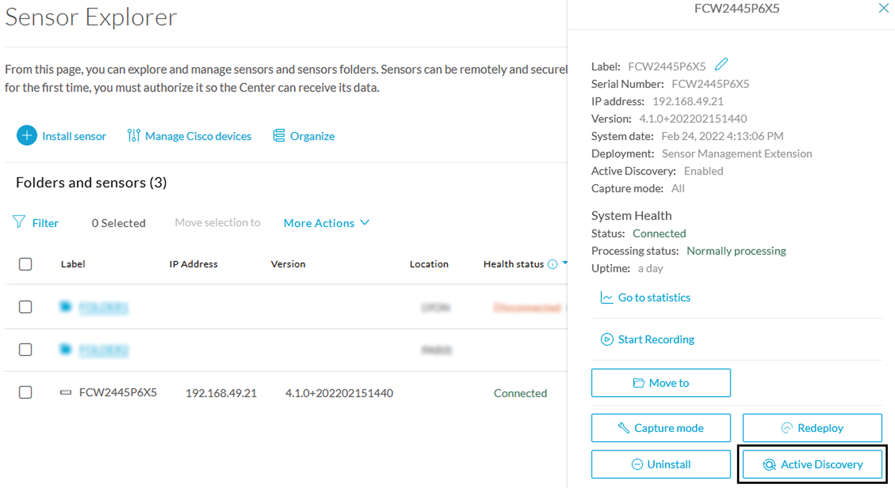
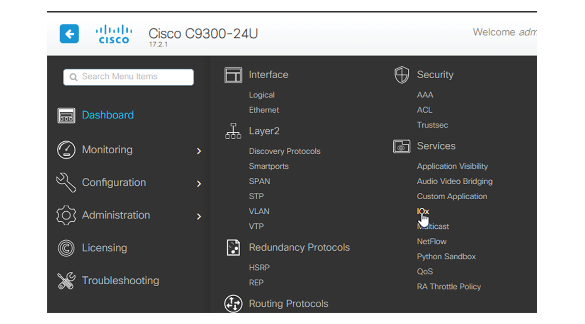
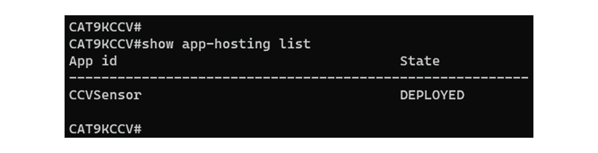

# Cisco Cyber Vision Configuration For Catalyst 9300 Series

## About this guide

### Purpose

This guide describes how to perform a clean installation of Cisco Cyber Vision on:

* Cisco Catalyst 9300 Series switches.

This guide is applicable to **system Cyber Vision version 4.1.0**.

## Overview

Proposed architecture:

The architecture proposed and described in this guide is to serve as an example.  The local network engineer should be consulted before applying the parameters used in this guide.  IP addresses, port numbers and VLAN IDs for your operational environment should be verified.

The schema below explains the architecture virtually deployed in the switch to embed the sensor application. VLAN and physical port configuration will allow OT traffic to be copied and communication with the Cisco Cyber Vision Center to be established.

The communication between the Cisco Cyber Vision Center and the sensor is represented in blue on the schema. Mirrored OT traffic is represented in yellow.

The architecture in this document is meant for a switch with an embedded sensor directly connected to the Cisco Cyber Vision Center. The schema presents two types of architecture:

* one with a direct connection to the Center (link="switchport access vlan 507").
* the other with a trunk to another switch or router which is connected to the Center (link="switch mode trunk").

Multiple types of sensor installations are explained below. One method is the automated installation using the Sensor Management extension within the Cyber Vision Center; this is the preferred method for installing sensors, which possible. This method requires access for the Cisco Cyber Vision Center to connect and authenticate to the switche's Local Manager GUI interface . Several solutions exist:

having the Center on the same subnet than the switch's Local Manager (<admin_VLAN> and <collection_VLAN> are the same).

having a route path from the Center to an <admin_VLAN> that is different from <collection_VLAN>.

Any port of the switch can be used for the communication with the Center or for OT traffic.

**Cisco Catalyst 9300 Series Switch:**


## Prerequisites

The hardware must have an access set to the Local Manager and to the CLI (ssh or console port).

**Elements to collect**

* The Cisco Cyber Vision Sensor application to collect from Cisco.com, i.e.
    * CiscoCyberVision-IOx-x86-64-<version>.tar (Cisco Catalyst 9300)
    * CiscoCyberVision-IOx-Active-Discovery-x86-64-<version>.tar (Cisco Catalyst 9300 with Active Discovery)
* A console cable, for the connection to the hardware's console port.

OR

* An Ethernet cable, for the connection to one of the hardware's port.

## Hardware front view

Before starting, take a moment to note and/or unscrew the following parts you're going to use during the procedure.

**Cisco Catalyst 9300 Series switch:**

* x24 RJ45 10/100/1000 BaseT connector (1)
* mini-USB console connector (2)


# Known issues

* The deployment procedure with the Local Manager is not supported by firmware version 17.3.x. Perform the procedure with [Cisco Cyber Vision management extension](https://www.cisco.com/c/en/us/td/docs/security/cyber_vision/publications/IE3400/b_Cisco_Cyber_Vision_Network_Sensor_Installation_Guide_for_Cisco_IE3300_10G_Cisco_IE3400_and_Cisco_Catalyst_9300/m_Installation_procedures_IE3400_Catalyst_9300_v3_4_0_0.html#topic_5701) instead.
* Cisco Catalyst 9300: deployments will be possible for sensors on firmware version 17.6.x as of Cisco Cyber Vision version 4.0.1.

## Installation procedures

### Initial configuration

#### Preliminary remarks

An example of configuration is given in the following pages. It’s given to help the user to start to use a Cisco Cyber Vision Sensor embedded in a switch. More complex configurations could be needed in this case a trained user will have to configure the switch with all VLAN and port configuration needed.

#### Configure switch access

https://www.cisco.com/c/en/us/support/switches/catalyst-9300-series-switches/series.html#~tab-documents

#### Check the software version

Check the software version using the following command in the switch's CLI: ```show version```

The displayed version must be 17.02.01 or higher to be compatible with the Cisco Cyber Vision Sensor Application.

Cisco Catalyst 9300:


If the version is lower, you must update the switch firmware. To do so, follow the links to the products page in [Configure switch access](https://www.cisco.com/c/en/us/td/docs/security/cyber_vision/publications/IE3400/b_Cisco_Cyber_Vision_Network_Sensor_Installation_Guide_for_Cisco_IE3300_10G_Cisco_IE3400_and_Cisco_Catalyst_9300/m_Installation_procedures_IE3400_Catalyst_9300_v3_4_0_0.html#topic_5688).

#### SSD Disk (Catalyst 9300)

If not already done, insert a 120GB Cisco SSD disk in the SSD slot.

* You can format the SSD disk using the following command: ```format usbflash1: ext4```


* You can check the file system using the following command (check for ext4 and Read/Write): ```show usbflash1: filesys```


#### Check date and time

The internal clock of the switch must be synchronized and configured properly.

1. Check the date and time using the following command: ```show clock```


2. If needed, adjust to the UTC time using the following command: ```clock set [hh:mm:ss] [month] [day] [year]```

Or go to the Local Manager:


#### Enable IOx

Before installing the Cisco Cyber Vision sensor on the hardware, you must enable IOx.

1. Enable IOx using the following commands: ```configure terminal``` and ```iox```


2. Check the IOx service status using the following commands: ```exit``` and ```show iox```


#### Add the necessary configuration parameters (Catalyst 9300)

The example of configuration given below is a simple one. This configuration is only valid if a direct link exists between the Center and the switch with the embedded sensor. In this case, the dedicated port is configured with the Collection VLAN (for example, 507). In many other cases, the port used for communication between the Center and the sensor will have to be configured as trunk.

1. Open the Cisco Catalyst 9300 CLI through ssh or via the console terminal.
2. Configure a vlan for traffic mirroring using the following commands:
```configure terminal```
```vlan 2508```
```exit```
```int vlan 2508```
```ip address 169.254.1.1 255.255.255.252```
```no shutdown```
```exit```


3. Configure the AppGigabitEthernet port which will enable the communication to the IOx virtual application:
```interface AppGigabitEthernet 1/0/1```
```switchport mode trunk```
```exit```


4. Configure the SPAN session and add to the session the interfaces to monitor:
```monitor session 1 type erspan-source```
```source interface Gi1/0/2 - 24 both```
```no shutdown```
```destination```
```erspan-id 2```
```mtu 9000```
```ip address 169.254.1.2```
```origin ip address 169.254.1.1```
```exit```
```exit```


5. Configure one of the switch's ports to enable the communication between the virtual sensor and the Center:
```interface GigabitEthernet1/0/1```
```switchport access vlan 507```
```no shutdown```
```exit```


6. Save the configuration:
```exit```
```write mem```


The initial configuration is now complete. Proceed with the application installation and deployment following one of the procedures below:

* Procedure with the Cyber Vision sensor management extension
* Procedure with the Local Manager
* Procedure with the CLI.

#### Method 1: Procedure with the Cyber Vision sensor management extension

After the Initial configuration, proceed to the steps described in this section. This section also describes the steps to configure Active Discovery.

**Note** To be able to use the Cisco Cyber Vision sensor management extension, an IP address reachable by the Center Collection interface must be set on the Collection VLAN.

##### Install the Sensor Management extension

To install the Sensor Management extension, you must:

1. Retrieve the extension file (i.e. CiscoCyberVision-sensor-management-<version>.ext) from cisco.com.
2. Access the Extension administration page in Cisco Cyber Vision.
3. Import the extension file.


Once the sensor management extension is installed, you will find a new management job under the sensor administration menu ([Management jobs page](https://www.cisco.com/c/en/us/td/docs/security/cyber_vision/publications/IE3400/b_Cisco_Cyber_Vision_Network_Sensor_Installation_Guide_for_Cisco_IE3300_10G_Cisco_IE3400_and_Cisco_Catalyst_9300/m_Installation_procedures_IE3400_Catalyst_9300_v3_4_0_0.html#topic_5850)), and the Install via extension button will be enabled in the Sensor Explorer page.

##### Management jobs

As some deployment tasks on sensors can take several minutes, this page shows the jobs execution status and advancement for each sensor deployed with the sensor management extension.

This page is only visible when the sensor management extension is installed in Cisco Cyber Vision.


You will find the following jobs:

* Single deployment
    * This job is launched when clicking the Deploy Cisco device button in the sensor administration page, that is when a new IOx sensor is deployed.
* Single redeployment
    * This job is launched when clicking the Reconfigure Redeploy button in the sensor administration page, that is when deploying on a sensor that has already been deployed. This option is used for example to change the sensor's parameters like enabling active discovery.
* Single removal
    * This job is launched when clicking the Remove button from the sensor administration page.
* Update all devices
    * This job is launched when clicking the Update Cisco devices button from the sensor administration page. A unique job is created for all managed sensors that are being updated.

If a job fails, you can click on the error icon to view detailed logs.


##### IOx APP sensor creation

1. In Cisco Cyber Vision, navigate to Admin > Sensors > Sensor Explorer and click Install sensor, then Install via extension.


2. Fill the requested fields so Cisco Cyber Vision can reach the switch:
    * IP address: admin address of the switch
    * Port: management port (443)
    * Login: user with the admin rights of the switch
    * Password: password of the admin user
    * Capture Mode: Optionally, select a capture mode.


3. Click the Connect button.

The Center will join the switch and the second parameter list will be displayed. For this step to succeed, the switch needs to be reachable by the Center on its eth1 connection.

##### IOx APP sensor configuration

If the Center can join the switch, the following form appears:


While some parameters are filled automatically, you can still change them if necessary.

1. Fill the following parameters for the Collection interface:
    * Capture IP address: IP address destination of the monitor session in the sensor
    * Capture prefix length: mask of the capture IP address
    * Capture VLAN number: VLAN of the monitor session in the sensor
    * Collection IP address: IP address of the sensor in the device
    * Collection prefix length: mask of the Collection IP address
    * Collection gateway: gateway of the Collection IP address
    * Collection VLAN number: VLAN of the sensor
2. Click Next.
3. **Active Discovery**
    * If you want to enable Active Discovery on the sensor, select Passive and Active Discovery.
    * You can:
        * use the sensor Collection interface by selecting it:
        
        * add new network interfaces filling the following parameters to set dedicated network interfaces and clicking Add:
            * IP address
            * Prefix length
            * VLAN number
        
4. Click the Deploy button.
    * The Center starts deploying the sensor application on the target equipment. This can take a few minutes. You can go to the Management jobs page to check the deployment advancements.
    
    * Once the deployment is finished, a new sensor appears in the sensors list.
    * The sensor's status will eventually turn to connected.
    
    * If the Active Discovery has been enabled and set -that is if the option "Passive and Active Discovery" was selected during the IOX App sensor configuration- the sensor is displayed as below with Active Discovery's status as Enabled.
    

##### Configure Active Discovery

Once the sensor is connected, you can change the Active Discovery's network interface so it uses the Collection network interface instead, and add several network interfaces for the sensor to perform Active Discovery on several subnetworks at the same time.

**Procedure**

1. Click the sensor to configure and click the Active Discovery button on its right side panel.
    
    The Active Discovery configuration appears with the interface currently set.
2. Select Use collection interface for the Active Discovery to use the Collection network interface.
    
    To add a network interface to Active Discovery for the sensor to perform active monitoring on another subnetwork:
3. Add a new network interface by clicking the corresponding button.
4. Fill the following parameters to set dedicated network interfaces:
    * IP address
    * Prefix length
    * VLAN number
5. Click Add.
    
    You can add as many network interfaces as needed.
6. When you are done, click Configure.
    A message saying that the configuration has been applied successfully appears.

#### Method 2: Procedure with the Local Manager

After the Initial configuration, proceed to the steps described in this section.

##### Access the Local manager

1. Open a browser and navigate to the IP address you configured on the interface you are connected to.
2. Log in using the Local Manager user account and password.
    
    
3. Once logged into the Local Manager, navigate to Configuration > Services > IOx.
    
4. Log in using the user account and password.
    

##### Install the sensor virtual application

Once logged in, the following menu appears:


1. Click Add New.
2. Add an Application id name (e.g. CCVSensor).
3. Select the application archive file ```"CiscoCyberVision-IOx-x86-64-xxx.tar"```
    
    The installation takes a few minutes.
    
    When the application is installed, the following message is displayed:
    

##### Configure the sensor virtual application

1. Click Activate to launch the configuration of the sensor application.
    
2. Change the disk size from the default size to 80,000 MB. The disk size must not be smaller than this.
    
3. Bind the interfaces in the container to an interface on the host in Network Configuration. Start with eth0 by clicking edit in the eth0 line.
    
4. Select the mgmt.-bridge300 entry in the interface list.
    
5. Click Interface Setting.
    
6. Apply the following configurations:
    * Select Static
    * IP/Mask: the IP and mask of the sensor
    * Default gateway: the IP address of the Center
    * Vlan ID, which is defined below, is the VLAN in the Cisco Catalyst 9300 dedicated to the Collection network interface (link between the Center and the sensors), e.g. 507.
    
7. IPV6 must be set to Disable.
    
8. Click OK twice.
    
9. Click OK again on the following popup.
    
10. Apply the following configurations to eth1:
    * Select the mgmt.-bridge300 entry in the interface list
    * Select Static
    * IP/Mask: the IP and mask of the sensor for mirrored traffic
    * Vlan ID, will be defined below, is the VLAN in the Cisco Catalyst 9300 dedicated to traffic mirroring.
    
11. IPV6 must be set to Disable.
    
12. Click OK until you come back to the screen below.
13. Click the Activate App button.
    
    The operation takes several seconds.
    
14. Click Applications to display the application status:
    
15. The application is activated and needs to be started. To do so, click the Start button.
    
    The operation takes several seconds.
    
    The application status changes to "RUNNING".
    

##### Generate the provisioning package

1. In Cisco Cyber Vision, navigate to Admin > Sensors > Sensor Explorer and click Install sensor and Manual install.
    
    The manual install wizard appears.
2. Select Cisco IOx Application and click Next.
    
3. Fill the fields to configure the sensor provisioning package:
    * The serial number of the hardware.
    * Center IP: leave blank.
    * Gateway: add if necessary.
    * Optionally, select a capture mode.
    
4. Click Create sensor.
5. Click the link to download the provisioning package.
    
    This will download the provisioning package which is a zip archive file with the following name structure: <sbs-sensor-config-serialnumber>.zip (e.g. "sbs-sensor-configFCW23500HDC.zip").
6. Click Finish.
7. A new entry for the sensor appears in the Sensor Explorer list.
    The sensor status will switch from Disconnected to Connected.
    

##### Import the provisioning package

1. In the Local manager, in the IOx configuration menu, click Manage.
    
2. Navigate to App_DataDir.
    
3. Click Upload.
    
4. Choose the provisioning package downloaded (i.e. "sbs-sensor-config-FOC2334V01X.zip") and add the exact file name in the Path field (i.e. "sbs-sensor-config-FOC2334V01X.zip").
5. Click OK.
    
    A popup indicating that Cisco Cyber Vision has been deployed successfully appears.
6. Click OK.

#### Method 3: Procedure with the CLI

After the Initial configuration, proceed to the steps described in this section.

##### Configure the sensor application

**Note** In this section, "CCVSensor" is used as the appid.

1. Connect to the device through SSH or a console.
2. Configure the application payload by typing the following commands:
    ```enable```
    ```configure terminal```
    ```app-hosting appid CCVSensor```
    ```app-vnic AppGigabitEthernet trunk```
    ```vlan 507 guest-interface 0```
    ```guest-ipaddress 192.168.69.210 netmask 255.255.255.0```
    ```vlan 2508 guest-interface 1```
    ```guest-ipaddress 169.254.1.2 netmask 255.255.255.0```
    ```app-default-gateway 192.168.69.1 guest-interface 0```
    ```app-resource profile custom```
    ```persist-disk 8192```
    ```cpu 7400```
    ```memory 2048```
    ```vcpu 2```
    ```end```
    

For the app-resource profile's custom values, refer to the result of the show app-hosting resource command.

In this example, all maximum values are used for:

* the CPU (CPU available units, here 1400 for the Cisco IE3300 10G/IE3400, and 7400 for the Cisco Catalyst 9300),
* the vcpu (here 2), the memory (Memory available, here 2048),
* the disk (only 2048 MB and 8192 MB respectively are used to let space for application updates).

##### Install the sensor application

The sensor package is to be retrieved on cisco.com. The file has the following name structure: ```CiscoCyberVision-IOx-x86-64-3.1.0.tar```

1. Copy the package to a USB key or in the flash memory.
2. Type the following commands on the CLI:
    ```enable```
    ```app-hosting install appid CCVSensor package usbflash0:<FILENAME>.tar```
    
    **Note** Adjust "usbflash0:" in accordance with the sensor package's localization (USB port or flash memory).
    **Note** Replace "CiscoCyberVision-IOx-aarch64-3.1.0-RC4.tar" with the right filename.
3. Check that the application is in "DEPLOYED" state: ```show app-hosting list```
    
4. Activate the application using the following command: ```pp-hosting activate appid CCVSensor```
    
5. Start the application using the following command: ```app-hosting start appid CCVSensor```
    

##### Generate the provisioning package

1. In Cisco Cyber Vision, navigate to Admin > Sensors > Sensor Explorer and click Install sensor and Manual install.
    
    The manual install wizard appears.
2. Select Cisco IOx Application and click Next.
    
3. Fill the fields to configure the sensor provisioning package:
    * The serial number of the hardware.
    * Center IP: leave blank.
    * Gateway: add if necessary.
    * Optionally, select a capture mode.
    
4. Click Create sensor.
5. Click the link to download the provisioning package.
    
    This will download the provisioning package which is a zip archive file with the following name structure: <sbs-sensor-config-serialnumber>.zip (e.g. "sbs-sensor-configFCW23500HDC.zip").
6. Click Finish.
7. A new entry for the sensor appears in the Sensor Explorer list.
    The sensor status will switch from Disconnected to Connected.
    

##### Copy the sensor application provisioning package

* Copy the provisioning package from the USB key to the application using the following command: ```app-hosting data appid CCVSensor copy usbflash0:sbs-sensor-config-<SERIAL-NUMBER>.zip sbs-sensor-config-<SERIAL-NUMBER>.zip```


### Final step

In the sensor's CLI save the product's configuration by typing the following command: ```write mem```

## Upgrade procedures

### Upgrade through the sensor management extension

To upate IOx sensors, you just need to update the Cisco Cyber Vision sensor management extension.

To do so, navigate to the extensions administration page and click the Update this extension button to browse the new version of the extension file.


Cisco Cyber Vision will attempt to update all IOx sensors. This will take a moment. Update advancements are visible in the **Management jobs page**. A job will be created for each sensor.

If a sensor update fails, check the management jobs error messages to have more information, and use the Update Cisco Devices button.

### Upgrade through the Local Manager

The following section explains how to upgrade the sensor through the Local Manager.

In the Cisco Cyber Vision sensor administration page, the sensor is in 3.2.2. In the example below, we will upgrade a sensor to Cisco Cyber Vision version 3.2.3.


1. Access the Local Manager.
2. Stop the application.
    
    The operation takes a few moments.
    
    The application status switches to STOPPED.
    In Cisco Cyber Vision, the sensor status switches to Disconnected.
    
3. In the Local Manager, click the Deactivate button.
    * The application status moves to "DEPLOYED".
4. Click Upgrade.
    
    The pop up Upgrade application appears.
    
5. Select the option Preserve Application Data.
6. Select the new version of the application archive file.
    e.g. CiscoCyberVision-IOx-aarch64-3.2.3.tar
    
    The operation takes a few moments.
    
    A message indicating that the sensor has been successfully upgraded is displayed.
    
7. Check the number of the new version.
8. Click Activate.
    
9. Check configurations.
    **It can happen that network configurations are lost during the upgrade. If they are, refer to Configure the sensor virtual application and do as explained.**
10. Click the Activate App button.
    The application status moves to ACTIVATED.
11. Click the Start button.
    The application status changes to RUNNING.
    In Cisco Cyber Vision, the sensor is upgraded from version 3.2.2 to 3.2.3 and its status moves to Connected.
    

## Reconfigure/Redeploy a sensor

The Redeploy button is used when you need to replace a sensor model with another one keeping the same network configurations (e.g. replacing a Cisco IE3400 with a Cat 9300), change configurations, or if you need to reconfigure the sensor (e.g. to enable Active Discovery).

To do so:

**Procedure**

1. On the Sensor Explorer page, click the sensor to reconfigure/redeploy. The sensor right side panel appears.
2. Click the Redeploy button.
    
    A pop up asking to confirm the redeployment of the sensor appears.
3. 	Click OK to proceed.
    A summary of the sensor configuration is displayed. In this example, we're going to change the Collection VLAN number.
4. Click Start.
    
5. Enter the credentials to reach the sensor to redeploy and click Connect.
    
6. Click the blue link to fill the warning fields with the current sensor configuration. We change the Collection VLAN number value to 49.
    
7. Click Next.
8. You can enable Active Discovery selecting Passive and Active Discovery.
9. 	Click Deploy.
    A message saying that the sensor is being redeployed appears. You can eather go the jobs page or go back to the Sensor Explorer page.
10. Click Go to the jobs page.
    
    You are redirected to the Management jobs page to see the redeployment advancement. This can take several minutes.
    
    If you go back to the Sensor Explorer page, you will see that the sensor is in Redeploying status.
    
    Once the redeployment is finished, the sensor will switch status to connected and the Active Discovery to Enabled.
    
