# Cisco Cyber Vision Documentation

Cisco Cyber Vision Network Sensor Installation Guide for Cisco IE3300 10G, Cisco IE3400 and Cisco Catalyst 9300, Release 4.1.0

## About this documentation

### Document Purpose

This installation guide describes how to perform a clean installation of Cisco Cyber Vision on:

* Cisco Catalyst IE3300 10G Rugged Series Switch
* Cisco Catalyst IE3400 Rugged Series Switch
* Cisco Catalyst 9300 Series Switch.

Moreover, this document describes how to upgrade sensors through different methods.

This documentation is applicable to **system version 4.1.0**.

### Warnings and notices

This manual contains notices you have to observe to ensure your personal safety as well as to prevent damage to property.

The notices referring to your personal safety and to your property damage are highlighted in the manual by a safety alert symbol described below. These notices are graded according to the degree of danger.


**Warning**

Indicates risks that involve industrial network safety or production failure that could possibly result in personal injury or severe property damage if proper precautions are not taken.


**Important**

Indicates risks that could involve property or Cisco equipment damage and minor personal injury if proper precautions are not taken.


**Note**

Indicates important information on the product described in the documentation to which attention should be paid.

## Overview

Proposed architecture:

The architecture proposed and described in this document is for demonstration. The local network engineer should be consulted before applying the parameters used in this document. IP addresses, port numbers and VLAN IDs used should be verified beforehand as wrong configurations could stop normal exchanges and stop the process.

The schema below explains the architecture virtually deployed in the switch to embed the sensor application. VLAN and physical ports configuration will allow OT traffic to be copied and communication with the Cisco Cyber Vision Center to be established.

The communication between the Cisco Cyber Vision Center and the sensor is represented in blue on the schema. Mirrored OT traffic is represented in yellow.

The architecture in this document is meant for a switch with an embedded sensor directly connected to the Cisco Cyber Vision Center. The schema presents two types of architecture:

* one with a direct connection to the Center (link="switchport access vlan 507").
* the other with a trunk to another switch or router which is connected to the Center (link="switch mode trunk").

Several types of installation are explained. One of them is the installation with the Sensor Management extension. This method requires an access for the Cisco Cyber Vision Center to the switch's Local Manager. Several solutions exist:

having the Center on the same subnet than the switch's Local Manager (<admin_VLAN> and <collection_VLAN> are the same).

having a route path from the Center to an <admin_VLAN> that is different from <collection_VLAN>.

Any port of the switch can be used for the communication with the Center or for OT traffic.

**Cisco Catalyst IE3300 10G & IE3400 Rugged Series Switch:**

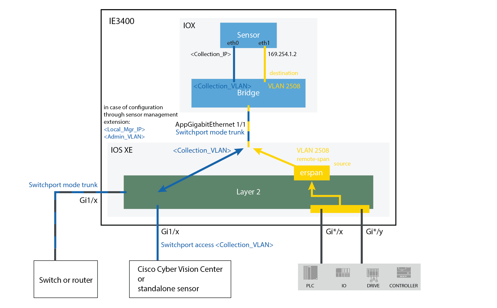

**Cisco Catalyst 9300 Series Switch:**


## Prerequisites

The hardware must have an access set to the Local Manager and to the CLI (ssh or console port).

**Elements to collect**

* The Cisco Cyber Vision Sensor application to collect from Cisco.com, i.e.
    * CiscoCyberVision-IOx-aarch64-<version>.tar (Cisco IE3300 10G, Cisco IE3400)
    * CiscoCyberVision-IOx-x86-64-<version>.tar (Cisco Catalyst 9300)
    * CiscoCyberVision-IOx-Active-Discovery-aarch64-<version>.tar (Cisco IE3300 10G, Cisco IE3400 with Active Discovery)
    * CiscoCyberVision-IOx-Active-Discovery-x86-64-<version>.tar (Cisco Catalyst 9300 with Active Discovery)
* A console cable, for the connection to the hardware's console port.

OR

* An Ethernet cable, for the connection to one of the hardware's port.

## Additional remarks

**About the IE3400 and IE3300 10G platforms:**

Cisco Cyber Vision Sensor application will receive ERSPAN traffic. Due to ERSPAN overhead it is recommended to not update the MTU of the platform (switch IE3x00) above 1940 bytes. Otherwise, large packets above 1940 will not be received by the sensor application.

## Hardware front view

Before starting, take a moment to note and/or unscrew the following parts you're going to use during the procedure.

**Cisco Catalyst IE3300 10G Rugged Series Switch:**

* 8x RJ45 10/100/1000 BaseT connector (1)
* 2x SFP 10G fiber port (2)
* SD CARD (3)
* Console connectors (4) RJ-45 and mini-USB

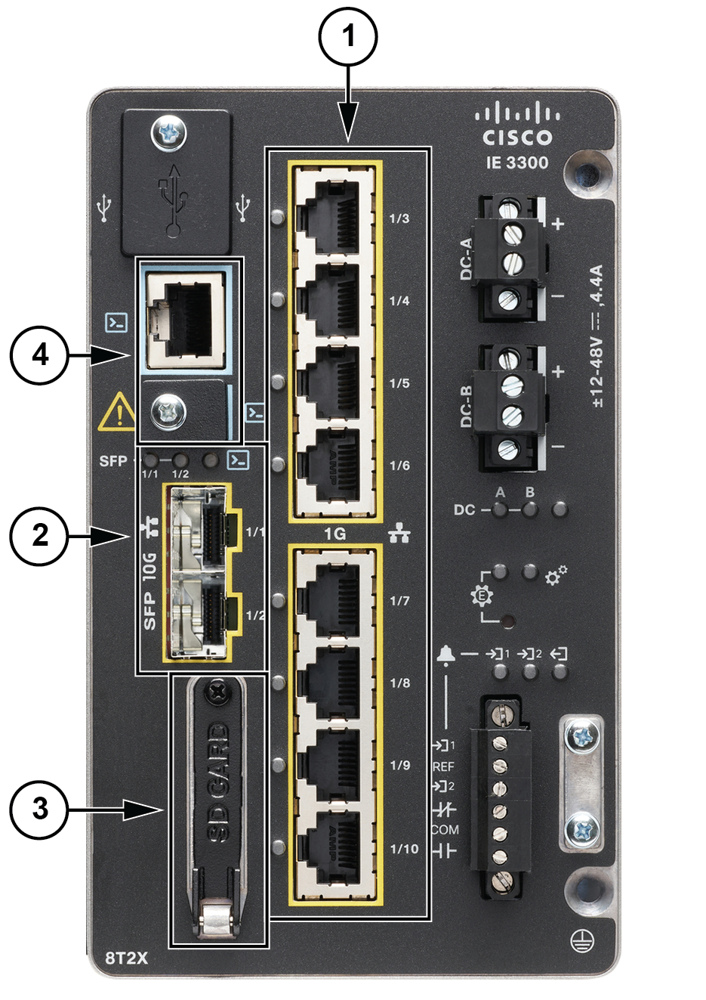

**Cisco Catalyst IE3400 Rugged Series Switch:**

* 8x RJ45 10/100/1000 BaseT connector (1)
* 2x SFP 1G fiber port (2)
* SD CARD (3)
* Console connectors (4) RJ-45 and mini-USB


**Cisco Catalyst 9300 Series switch:**

* x24 RJ45 10/100/1000 BaseT connector (1)
* mini-USB console connector (2)

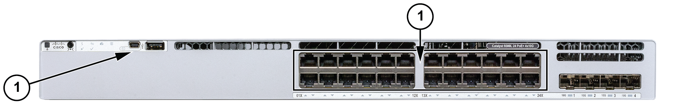

# Known issues

* The deployment procedure with the Local Manager is not supported by firmware version 17.3.x. Perform the procedure with [Cisco Cyber Vision management extension](https://www.cisco.com/c/en/us/td/docs/security/cyber_vision/publications/IE3400/b_Cisco_Cyber_Vision_Network_Sensor_Installation_Guide_for_Cisco_IE3300_10G_Cisco_IE3400_and_Cisco_Catalyst_9300/m_Installation_procedures_IE3400_Catalyst_9300_v3_4_0_0.html#topic_5701) instead.
* Cisco Catalyst 9300: deployments will be possible for sensors on firmware version 17.6.x as of Cisco Cyber Vision version 4.0.1.

## Installation procedures

### Initial configuration

#### Preliminary remarks

An example of configuration is given in the following pages. It’s given to help the user to start to use a Cisco Cyber Vision Sensor embedded in a switch. More complex configurations could be needed in this case a trained user will have to configure the switch with all VLAN and port configuration needed.

#### Configure switch access

https://www.cisco.com/c/en/us/support/switches/catalyst-9300-series-switches/series.html#~tab-documents

#### Check the software version

Check the software version using the following command in the switch's CLI: ```show version```

The displayed version must be 17.02.01 or higher to be compatible with the Cisco Cyber Vision Sensor Application.

Cisco Catalyst 9300:

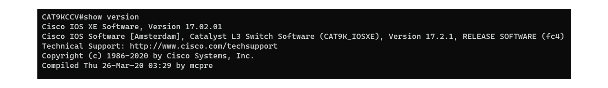

If the version is lower, you must update the switch firmware. To do so, follow the links to the products page in [Configure switch access](https://www.cisco.com/c/en/us/td/docs/security/cyber_vision/publications/IE3400/b_Cisco_Cyber_Vision_Network_Sensor_Installation_Guide_for_Cisco_IE3300_10G_Cisco_IE3400_and_Cisco_Catalyst_9300/m_Installation_procedures_IE3400_Catalyst_9300_v3_4_0_0.html#topic_5688).

#### SSD Disk (Catalyst 9300)

If not already done, insert a 120GB Cisco SSD disk in the SSD slot.

* You can format the SSD disk using the following command: ```format usbflash1: ext4```

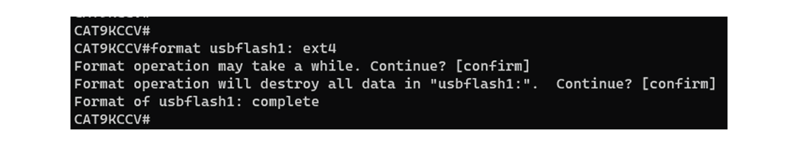

* You can check the file system using the following command (check for ext4 and Read/Write): ```show usbflash1: filesys```

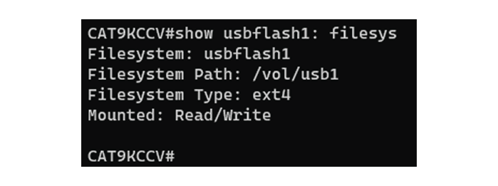

#### Check date and time

The internal clock of the switch must be synchronized and configured properly.


**Note**

Unlike hardware sensors (i.e. IC3000) that fetch their time from the Center, the Cyber Vision IOX application sensor gets the time from the host (switch platform). Therefore, it is critical that the host synchronizes its time with the Center or a valid NTP server if it’s synchronized with the Center. If the time difference is large (hours or more), the user should adjust the IE3400 time using the Local Manager so it is close to the reference time. If not, the synchronization may take many update cycles.

1. Check the date and time using the following command: ```show clock```

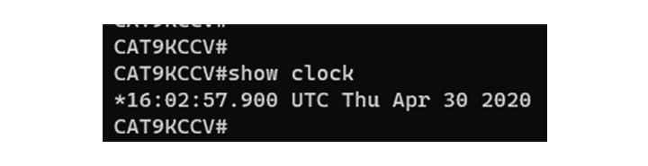

2. If needed, adjust to the UTC time using the following command: ```clock set [hh:mm:ss] [month] [day] [year]```

Or go to the Local Manager:

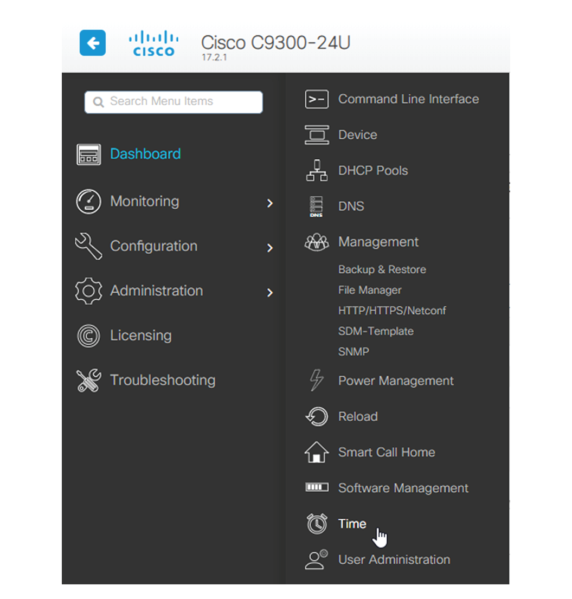

#### Enable IOx

Before installing the Cisco Cyber Vision sensor on the hardware, you must enable IOx.

1. Enable IOx using the following commands: ```configure terminal``` and ```iox```

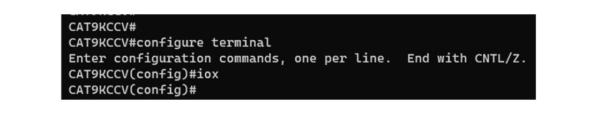

2. Check the IOx service status using the following commands: ```exit``` and ```show iox```

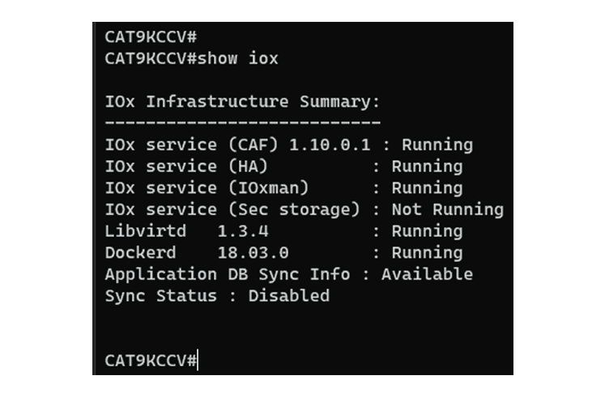

#### Add the necessary configuration parameters (Catalyst 9300)

The example of configuration given below is a simple one. This configuration is only valid if a direct link exists between the Center and the switch with the embedded sensor. In this case, the dedicated port is configured with the Collection VLAN (for example, 507). In many other cases, the port used for communication between the Center and the sensor will have to be configured as trunk.

1. Open the Cisco Catalyst 9300 CLI through ssh or via the console terminal.
2. Configure a vlan for traffic mirroring using the following commands:
```configure terminal```
```vlan 2508```
```exit```
```int vlan 2508```
```ip address 169.254.1.1 255.255.255.252```
```no shutdown```
```exit```

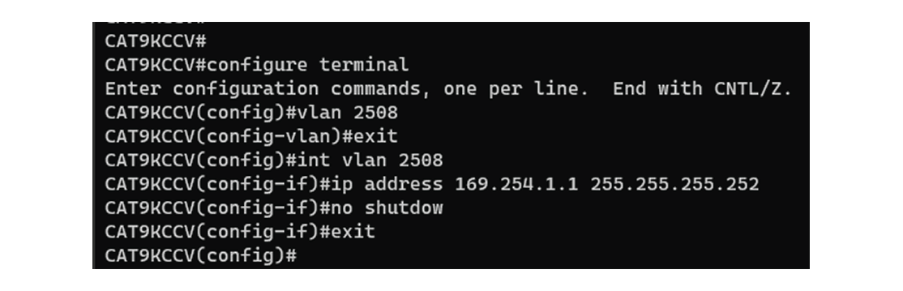

3. Configure the AppGigabitEthernet port which will enable the communication to the IOx virtual application:
```interface AppGigabitEthernet 1/0/1```
```switchport mode trunk```
```exit```

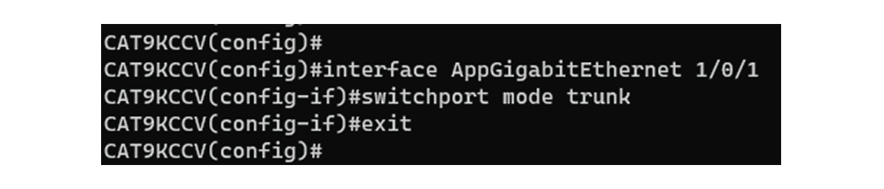

4. Configure the SPAN session and add to the session the interfaces to monitor:
```monitor session 1 type erspan-source```
```source interface Gi1/0/2 - 24 both```
```no shutdown```
```destination```
```erspan-id 2```
```mtu 9000```
```ip address 169.254.1.2```
```origin ip address 169.254.1.1```
```exit```
```exit```

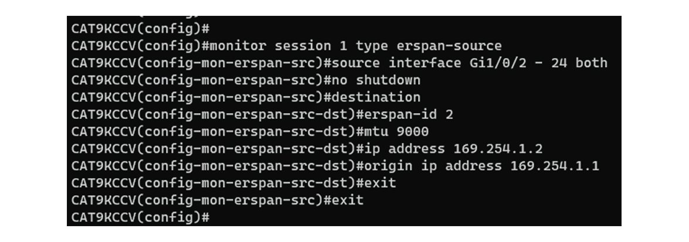

5. Configure one of the switch's ports to enable the communication between the virtual sensor and the Center:
```interface GigabitEthernet1/0/1```
```switchport access vlan 507```
```no shutdown```
```exit```

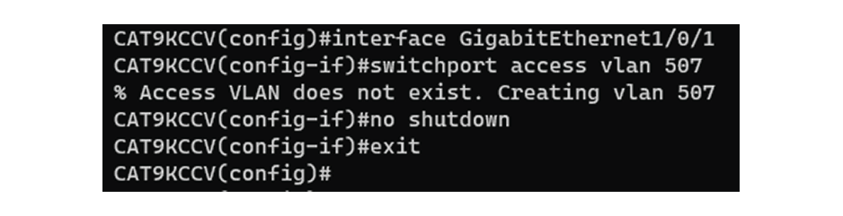

6. Save the configuration:
```exit```
```write mem```

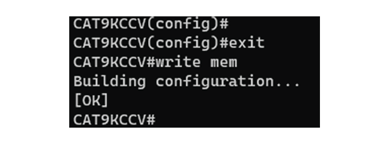

The initial configuration is now complete. Proceed with the application installation and deployment following one of the procedures below:

* Procedure with the Cyber Vision sensor management extension
* Procedure with the Local Manager
* Procedure with the CLI.

